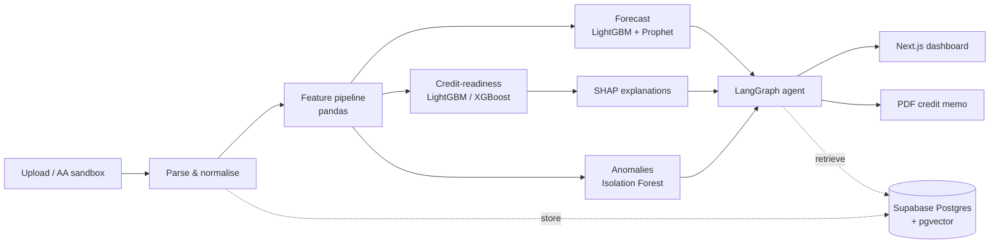
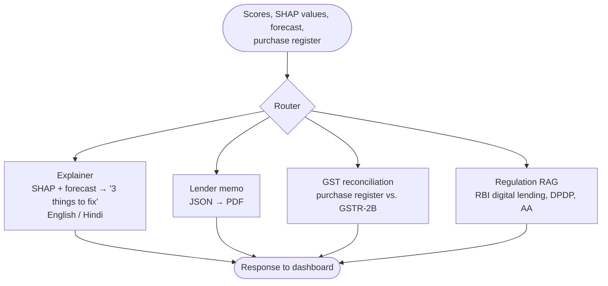

<!-- markdownlint-disable MD033 MD041 -->
<div align="center">

# CashLens

**Turns an Indian MSME's bank-statement + GST data into a 90-day cash-flow forecast, an explainable
credit-readiness score, and an AI agent that explains what to fix to get a working-capital loan —
and flags GST ITC mismatches.**

🚧 **Pre-alpha — under active development.** Nothing below is production-ready; most features are planned, not built.

</div>

<p align="center">
  <a href="https://github.com/trh-ds/cashlens/actions/workflows/ci.yml"></a>
  <a href="https://github.com/trh-ds/cashlens/actions/workflows/codeql.yml"></a>
  <!-- <a href="https://codecov.io/gh/trh-ds/cashlens"></a> -->
  <a href="LICENSE"></a>
  
  <br>
  
  
  
  
  
  
  <a href="https://huggingface.co/datasets/Akashved/Indian-Bank-Statements"></a>
  <br>
  <a href="https://github.com/astral-sh/ruff"></a>
  <a href="https://pre-commit.com/"></a>
  <a href="https://www.conventionalcommits.org/"></a>
  <a href="CONTRIBUTING.md"></a>
  <br>
  <a href="https://github.com/trh-ds/cashlens/stargazers"></a>
  <a href="https://github.com/trh-ds/cashlens/issues"></a>
  <a href="https://github.com/trh-ds/cashlens/commits/main"></a>
</p>
<!-- markdownlint-enable MD033 -->

**Borrower-side copilot, not a lender tool.** Explainable by design. Built only on synthetic, sandbox and user-uploaded data.

## Table of contents

- [Why CashLens](#why-cashlens)
- [What it will do](#what-it-will-do)
- [Architecture](#architecture)
- [Tech stack](#tech-stack)
- [ML approach](#ml-approach)
- [Data](#data)
- [Getting started](#getting-started)
- [Planned project structure](#planned-project-structure)
- [Roadmap](#roadmap)
- [Compliance & responsible AI](#compliance--responsible-ai)
- [Contributing](#contributing)
- [Security](#security)
- [License](#license)
- [Acknowledgements](#acknowledgements)
- [Maintainers](#maintainers)
- [Citation](#citation)

## Why CashLens

Indian MSMEs are credit-starved while being highly digital in payments — their transaction trail
already contains the evidence a lender needs, but nobody turns it into a story the owner can act on.

| Signal | Figure | Source |
| --- | --- | --- |
| Addressable MSME credit gap | ~₹30 lakh crore | [SIDBI, May 2025](https://www.sidbi.in/) |
| MSMEs using digital loans vs. accepting digital payments | ~18% vs. 90%+ | [SIDBI](https://www.sidbi.in/) |
| Average time Indian SMEs take to pay invoices | 73 days (vs. 45-day statutory norm) | [Recordent SME Receivables Report 2026](https://www.recordent.com/) |
| Cost of wrongly claimed GST ITC | Reversal + interest under [Sec. 50(3), CGST Act](https://cbic-gst.gov.in/) (statutory cap 24% p.a.) | CGST Act, 2017 |

> [!NOTE]
> Figures are quoted from secondary summaries. Verify each against the primary release before citing
> them elsewhere. Blocked or mismatched ITC locks up working capital that a small business cannot spare.

## What it will do

Legend: 🟢 done · 🟡 in progress · ⚪ planned

| Status | Feature |
| --- | --- |
| ⚪ | Upload bank statements (or load sandbox data) and normalise them into one transaction schema |
| ⚪ | Categorise transaction narrations (NEFT/RTGS/IMPS/UPI, GST, rent, salary, EMI …) |
| ⚪ | 30/60/90-day net-inflow cash-flow forecast |
| ⚪ | Credit-readiness score with SHAP explanations |
| ⚪ | Agent that explains the score as "3 things to fix", in plain English (Hindi as stretch) |
| ⚪ | Lender-ready credit memo exported as PDF |
| ⚪ | GST ITC reconciliation: purchase register vs. synthetic GSTR-2B |
| ⚪ | Anomaly flags on transactions (Isolation Forest) |
| ⚪ | RAG chat over regulation (RBI digital lending, DPDP, Account Aggregator docs) |

## Architecture

### Data flow (planned)



### Agent graph (planned)



## Tech stack

| Layer | Planned choice |
| --- | --- |
| Frontend | Next.js 15/16, React 19, TypeScript, Tailwind CSS |
| API | FastAPI (Python 3.11+), Supabase Auth (JWT) |
| ML | pandas, scikit-learn, LightGBM, XGBoost, Prophet, SHAP |
| Agent | LangGraph |
| LLMs | Ollama (Llama / Qwen) for local dev; hosted API for the demo |
| Storage | Supabase Postgres + pgvector |
| Deploy | Docker Compose; frontend on Vercel |
| Quality | Ruff, pytest, pre-commit, GitHub Actions, CodeQL, Dependabot |

## ML approach

### Models

| Task | Model | Metrics |
| --- | --- | --- |
| Cash-flow forecast (30/60/90-day net inflow) | Prophet baseline, LightGBM with lag / rolling features | sMAPE, MAPE, directional accuracy |
| Credit-readiness | LightGBM / XGBoost classifier | AUC-ROC, PR-AUC, F1, calibration (Brier, reliability curve) |
| Narration categoriser | Text classifier | Macro-F1 |
| Anomaly detection | Isolation Forest | Precision@k on injected anomalies |
| Explanations | SHAP (TreeExplainer) | — |

### Features

Computed per account per month from the normalised transaction table:

- Average monthly credit and debit
- Inflow coefficient of variation (CoV)
- Distinct counterparties
- EMI / total-outflow ratio
- GST-filing regularity (GST payments per period)
- DSO proxy (days-sales-outstanding from inflow timing)
- Minimum-balance trend
- Bounced / failed transaction count
- Month-end balance stability

### Results

No models have been trained yet. This table will be filled only with reproducible numbers.

| Model | Metric | Value |
| --- | --- | --- |
| Forecast (90-day) | sMAPE | TBD |
| Forecast (90-day) | Directional accuracy | TBD |
| Credit-readiness | AUC-ROC | TBD |
| Credit-readiness | PR-AUC | TBD |
| Narration categoriser | Macro-F1 | TBD |

## Data

### Primary dataset

[`Akashved/Indian-Bank-Statements`](https://huggingface.co/datasets/Akashved/Indian-Bank-Statements)
on Hugging Face — synthetic Indian bank statements, licensed **Apache-2.0** per its dataset card.
CashLens downloads it at runtime and does not vendor it in this repository.

One row = one account statement.

| Field | Description |
| --- | --- |
| `bank_name`, `branch_name`, `branch_code`, `branch_phone` | Bank and branch details |
| `account_holder`, `account_holder_address`, `customer_id` | Holder details (fictional) |
| `account_number`, `ifsc_code`, `micr_code` | Account identifiers (fictional) |
| `account_type` | e.g. `CURRENT ACCOUNT- GENERAL` |
| `currency` | `INR` |
| `opening_balance`, `closing_balance` | Statement balances |
| `start_date`, `end_date`, `statement_date` | Statement period |
| `interest_rate` | Account interest rate |
| `transactions` | List of `{date, value_date, description, cheque_no, debit, credit, balance, branch_code, failed}` |

### Data notes & known quirks

- **Synthetic.** Banks and business names are fictional; sample statements cover Q1 2024 (Jan–Mar).
  Three months is short for a 90-day forecast — expect wide intervals.
- **Realistic rails.** Narrations cover NEFT, RTGS, IMPS, UPI, cheque clearing, ATM, cash deposit,
  salary, GST payment, rent, service charges and dividends.
- **Reversals and failures.** Contains `REVERSAL` rows and failed rows (`failed=true`, `debit` and
  `credit` both null, e.g. `FAILED-INSUFFICIENT FUNDS`). Failed rows feed the bounced/failed feature
  and are excluded from amounts.
- **Running balance does not always chain.** On some system-generated rows (recurring payments, service
  charges) `balance` is inconsistent. The pipeline recomputes balances from `opening_balance` plus signed amounts.
- **No credit-outcome labels.** There are no default / repayment outcomes, so credit-readiness targets are
  **weak, rule-derived labels**. Scores measure consistency with those rules, not real repayment
  probability. This is the project's main limitation.

### Secondary and planned sources

| Source | Use | Status |
| --- | --- | --- |
| Kaggle "Indian Banking Transaction Text" | Narration-category labels | ⚪ planned (check licence before use) |
| [Setu](https://setu.co/) / [Finvu](https://finvu.in/) AA sandboxes | Mock ReBIT-schema FI data | ⚪ planned |
| Synthetic GSTR-2B | GST ITC reconciliation | ⚪ planned (real GSTN return APIs need a GSP licence) |

### Licensing

Code in this repo is Apache-2.0. Third-party datasets keep their own licences; follow each source's terms
and never commit raw data (`data/raw/` is git-ignored).

## Getting started

> [!WARNING]
> No service code exists yet. Commands marked *(planned)* will not work until the matching files land.

### Prerequisites

- Python 3.11+
- Node.js 20+
- Docker + Docker Compose
- [Ollama](https://ollama.com/) (optional, for local LLMs)
- A [Supabase](https://supabase.com/) project (free tier is fine)

### Clone and configure

```bash
git clone https://github.com/trh-ds/cashlens.git
cd cashlens
cp .env.example .env
pip install pre-commit && pre-commit install
```

| Variable | Purpose |
| --- | --- |
| `SUPABASE_URL` | Supabase project URL |
| `SUPABASE_ANON_KEY` | Supabase anon key |
| `OLLAMA_BASE_URL` | Local Ollama endpoint, default `http://localhost:11434` |
| `LLM_API_KEY` | Hosted LLM key for the demo |
| `HF_TOKEN` | Optional; Hugging Face token if anonymous downloads are rate-limited |

### Run everything *(planned)*

```bash
docker compose up --build
```

### Run services individually *(planned)*

```bash
# API
cd backend && pip install -r requirements.txt && uvicorn app.main:app --reload

# ML pipeline
cd ml && pip install -r requirements.txt && python -m ml.train

# Frontend
cd frontend && npm ci && npm run dev
```

## Planned project structure

```text
cashlens/
├── frontend/          # Next.js dashboard
├── backend/           # FastAPI API + Supabase auth
├── ml/                # Feature pipeline, forecast, scoring, anomaly, SHAP
├── agent/             # LangGraph nodes: explainer, memo, GST, RAG
├── data/              # Download scripts + synthetic fixtures (raw/ is git-ignored)
├── docs/              # Design notes, model cards
├── .github/           # CI, CodeQL, Dependabot, issue/PR templates
├── docker-compose.yml
└── .env.example
```

## Roadmap

### Phase 0 — Setup

- [x] Licence, contributing guide, code of conduct, security policy
- [x] CI, CodeQL, Dependabot, pre-commit, issue/PR templates
- [ ] Monorepo skeleton (`frontend/`, `backend/`, `ml/`, `agent/`) and `docker-compose.yml`

### Phase 1 — ML core (MVP)

- [ ] Dataset loader + normaliser (balance recompute, failed/reversal handling)
- [ ] Feature pipeline
- [ ] Forecast baseline (Prophet) and LightGBM model
- [ ] Rule-derived labels + credit-readiness classifier with SHAP
- [ ] Narration categoriser

### Phase 2 — GenAI layer (MVP)

- [ ] LangGraph explainer node ("3 things to fix")
- [ ] Lender-memo node with PDF export

### Phase 3 — Integration (MVP)

- [ ] FastAPI endpoints + Supabase auth
- [ ] Next.js dashboard (upload, forecast, score, explanations)

### Phase 4 — Launch

- [ ] Hosted demo
- [ ] Model cards and published results

### Stretch

- [ ] GST ITC reconciliation vs. synthetic GSTR-2B
- [ ] RAG chat over RBI / DPDP / AA regulation
- [ ] Hindi explanations
- [ ] Anomaly flags in the UI
- [ ] AA sandbox live-connect (Setu / Finvu)

## Compliance & responsible AI

- **Account Aggregator.** Only entities regulated by RBI, SEBI, IRDAI or PFRDA can act as AA
  FIUs / FIPs. CashLens is neither and **never consumes real consented AA data** — only sandbox data.
- **Data.** Uses only synthetic data, sandbox data and the user's own uploads. Designed to be aware of the
  [Digital Personal Data Protection Act, 2023](https://www.meity.gov.in/data-protection-framework) and the
  DPDP Rules, 2025 (data minimisation, purpose limitation, deletion on request).
- **Explainability.** Follows the explainability principle of the RBI
  [FREE-AI Committee Report](https://rbi.org.in/Scripts/PublicationReportDetails.aspx?UrlPage=&ID=1306)
  (Framework for Responsible and Ethical Enablement of AI, Aug 2025): every score ships with its SHAP
  drivers and a plain-language explanation.
- **Known limitation.** Credit-readiness labels are rule-derived, not real outcomes (see [Data](#data-notes--known-quirks)).

> [!CAUTION]
> **Disclaimer.** CashLens is an educational / research project. It is **not financial or credit advice**,
> it is **not a lender**, and it must **not be used in production with real third-party financial data**.

## Contributing

Contributions are welcome — see [CONTRIBUTING.md](CONTRIBUTING.md) and the
[Code of Conduct](CODE_OF_CONDUCT.md). Newcomers can start with
[`good first issue`](https://github.com/trh-ds/cashlens/labels/good%20first%20issue).

## Security

Report vulnerabilities privately as described in [SECURITY.md](SECURITY.md).
**Never post real bank statements or financial data in issues or PRs.**

## License

[Apache License 2.0](LICENSE) © 2026 CashLens contributors.

## Acknowledgements

- [Akashved](https://huggingface.co/Akashved) for the
  [Indian-Bank-Statements](https://huggingface.co/datasets/Akashved/Indian-Bank-Statements) dataset
- [SIDBI](https://www.sidbi.in/) for MSME credit research
- [Sahamati](https://sahamati.org.in/) for Account Aggregator ecosystem documentation
- [NPCI](https://www.npci.org.in/) for UPI / payment-rail documentation
- [Recordent](https://www.recordent.com/) for SME receivables research

## Maintainers

- Tirth — [@trh-ds](https://github.com/trh-ds)
- *Partner — TBD*

## Citation

```bibtex
@software{cashlens2026,
  title  = {CashLens: an explainable credit-readiness copilot for Indian MSMEs},
  author = {{CashLens contributors}},
  year   = {2026},
  url    = {https://github.com/trh-ds/cashlens},
  license = {Apache-2.0}
}
```
